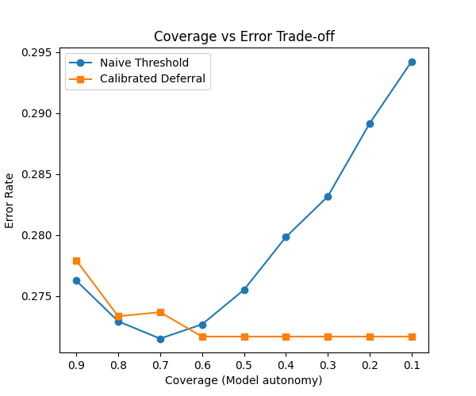

# AIRI 2026 — Calibrated Learning-to-Defer (Synthetic MEDAI)

[](https://github.com/KonkovaElena/airi-summer-school-2026/actions/workflows/repro.yml/badge.svg)
[](LICENSE)

Reproducible research software for comparing deferral policies under a fixed expert-review budget (~35%). **Synthetic only** — not clinical software.

## Frozen results (protocol 1.1, R=100)

| Policy | Mean accuracy (95% CI) | Mean review rate |
|--------|------------------------:|-----------------:|
| Calibrated deferral | 81.29% (81.18–81.38) | 33.96% |
| Naive threshold | 81.05% (80.98–81.11) | 34.92% |
| Model only | 71.87% (71.79–71.95) | 0.00% |
| Always review | 87.52% (87.47–87.58) | 100.00% |

Calibrated vs naive: **+0.24 pp** (95% CI [0.15, 0.33], p < 0.0001).

Canonical JSON: `artifacts/non_oracle_defer_results_2026_05_full_analysis.json`. See [REPRODUCE.md](REPRODUCE.md).

```bash
make verify   # frozen metrics + pytest (same gates as CI)
```

**Cite:** [CITATION.cff](CITATION.cff) · Tag [v1.1.1](https://github.com/KonkovaElena/airi-summer-school-2026/releases/tag/v1.1.1)


