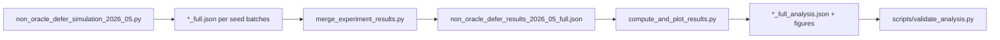

# Pipeline architecture

## Layers

1. **Simulation** (`artifacts/`) — generates per-seed metrics; records `pip freeze` hash when requested.
2. **Merge** — deduplicates seeds, attaches provenance metadata.
3. **Analysis** — bootstrap CIs, paired permutation tests, Holm correction; large bootstrap arrays in `.npy.gz` sidecars.
4. **Validation** — schema and provenance checks for CI.

## Containers

- **Docker** (`artifacts/Dockerfile`, Python 3.11-slim, hash-pinned requirements) — CI smoke (1 seed).
- **Host** — full R=100 rebuild per [REPRODUCE.md](../REPRODUCE.md).

## What is not in this repo

Application PDFs and private drafts (`AIRI_*.md`) live outside git per [.gitignore](../.gitignore).
